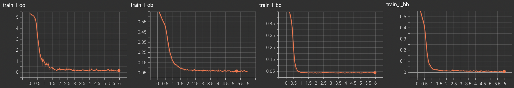
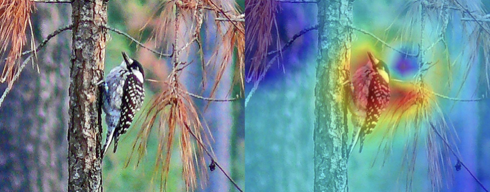
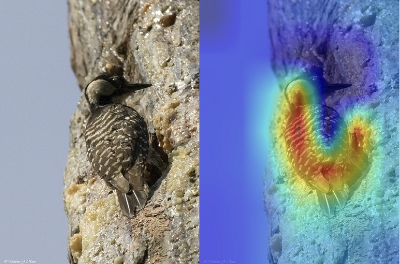

# Background-Aware-CAM-WSOL
[unofficial] Background-aware Classification Activation Map for Weakly Supervised Object Localization.  
Paper_link: https://arxiv.org/pdf/2112.14379.pdf  

## Requirements:  
pytorch==1.10.2  
torchvision==0.11.3  
pytorch-lightning==1.5.10  

## Train:  
````
python main.py --backbone resnet50 --mode train --lr 1.7e-04 --max_epochs 50 --class_num 200
````

## Inference:
````
python main.py --backbone resnet50 --mode infer --infer_ckpt ./path/to/checkpoint.pth --class_num 200
````

## Results:  
Loss:  

Output:  
 
